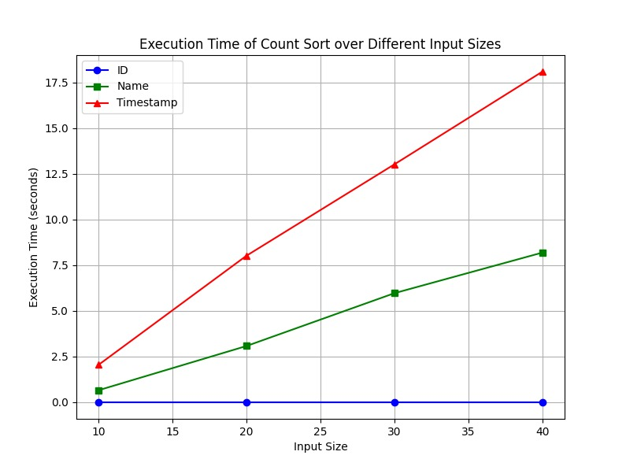

# Distributed Sorting Algorithms: Count Sort vs. Merge Sort

## Implementation Analysis
Given n files need to sort the files based on a chosen sorting criteria (NAME, ID OR TIMESTAMP). Sorting should be done using distributed merge and count sort .

Concurrency is used here to improve sorting efficiency by dividing the file sorting workload across multiple threads. Instead of sorting a large dataset sequentially, each thread sorts a subset of files in parallel, reducing the overall time required for sorting. This approach leverages multi-core CPUs, making it possible to handle larger datasets faster.

### Distributed Count Sort and Distributed Merge Sort
Distributed Count Sort: This variant of count sort divides files among multiple threads, each sorting a segment based on specific criteria (e.g., Name, ID or Timestamp). After each thread completes sorting its segment, the results are combined to produce the final sorted list.

Distributed Merge Sort: Here, files are divided into chunks, each handled by a separate thread using merge sort. Once each chunk is sorted, the program merges the sorted segments in a final pass to create the sorted output. This method is beneficial for larger datasets or complex criteria where count sort may not be efficient.

### Task Distribution

Both Distributed Count Sort and Distributed Merge Sort were adapted for a distributed system environment. The decision to distribute tasks was based on the nature of each algorithm:

**Distributed Count Sort:**
Count Sort distributes the range of input values across different systems, allowing each system to process a chunk of the input array in parallel. This approach leverages parallelism to handle large datasets efficiently.

*Pros:*
- Simple task distribution with minimal overhead.
- Easy to parallelize based on the data range.
- Effective for datasets with a known range of values.

*Cons:*
- Not as scalable for large ranges.
- High memory usage for large datasets with many distinct values.
- Difficult to sort timestamps as the mapped value of timestamps is too large to form an array.

**Distributed Merge Sort:**
Merge Sort was adapted by creating a thread per merge operation, allowing concurrent merging of two subarrays. After splitting the data, merge operations are recursively distributed across different systems.

*Pros:*
- Can handle large datasets effectively through recursive splitting.
- Well-suited for datasets of arbitrary size.
- Takes less momeory for large dataaset as compared to count sort.

*Cons:*
- More complex task distribution compared to Count Sort.
- Increased overhead from managing multiple threads for merging.

## Execution Time Analysis

Execution times for both algorithms were measured using datasets of varying sizes: small, medium, and large. Below are the results:

- **Small Dataset:** Both algorithms perform well, with Distributed Count Sort showing slightly faster results due to its simpler task distribution.
  
- **Medium Dataset:** As the dataset size increases, the difference becomes more noticeable. Distributed Merge Sort begins to show better scalability due to its efficient handling of larger datasets. 
  
- **Large Dataset:** For very large datasets, Distributed Merge Sort outperforms Distributed Count Sort, as Count Sort struggles with memory overhead. 

Even though the count sort only has to deal with max 42 files but since it depends on the range of the input , therefore the time taken is highly dependent on  the range of the value of the input taken.

## Memory Usage Overview

Both algorithms were evaluated for memory usage with small and large datasets.

**Distributed Count Sort:** Memory usage grows significantly with larger datasets, especially those with a wide range of values due to the need for allocating memory for counting occurrences in the input data.

**Distributed Merge Sort:** Memory usage increases linearly with dataset size as it needs to store intermediate results during the merge process. Remains the same for all the sorting criteria(Name , ID or Timestamp).

## Graphs

1. **Execution Time Across File Counts:**  
   A line graph illustrating execution time for both sorting algorithms across small, medium, and large datasets.

   ### For Count Sort
   

   ### For Merge Sort
   

2. **Memory Usage Comparison:**  
   A bar chart comparing memory usage for each sorting algorithm across varying dataset sizes.

   ### For Count Sort
   

   ### For Merge Sort
   

## Summary
Using concurrency, the files are sorted much faster and efficiently. 

In this comparison of Distributed Count Sort and Distributed Merge Sort, we observed the following:

- **Scalability:** Distributed Merge Sort scales better with larger datasets, particularly when exceeding a certain threshold.
  
- **Execution Time:** Distributed Count Sort is faster for small datasets (onlo fot id) but its performance degrades as dataset size increases. In contrast, Distributed Merge Sort maintains consistent performance across all sizes.
  
- **Memory Usage:** Distributed Count Sort requires more memory, especially for large datasets with a wide range of values. While Distributed Merge Sort also requires significant memory for large datasets, it remains more efficient as size increases.

### Potential Optimizations

**For Distributed Count Sort:**
Implementing more efficient memory management or using a hybrid approach with Merge Sort for larger ranges could enhance performance.
For string sorting other sorting algo such as radix sort would have been a better option as it would not require hashing the string.

**For Distributed Merge Sort:**
Optimizing thread management and reducing overhead during the merge phase could further improve performance.

